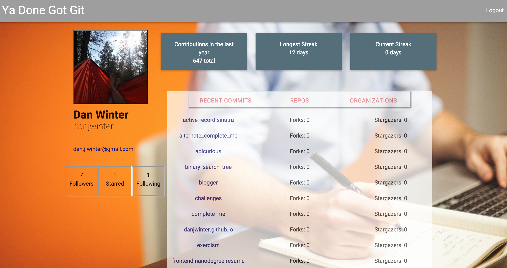

# Turing Module 3 Project - Git Yo Self
Hosted on [Heroku](https://git-yo-self.herokuapp.com/)

This project uses the Github API to implement a 3rd party app which utilizes OAuth 2.0 to log users in via Github and consume their data in a different dashboard view. It also uses Nokogiri to scrape data that is no longer available via API endpoints.

## Testing

The testing suite is written in RSpec and uses the VCR gem to record API responses.
